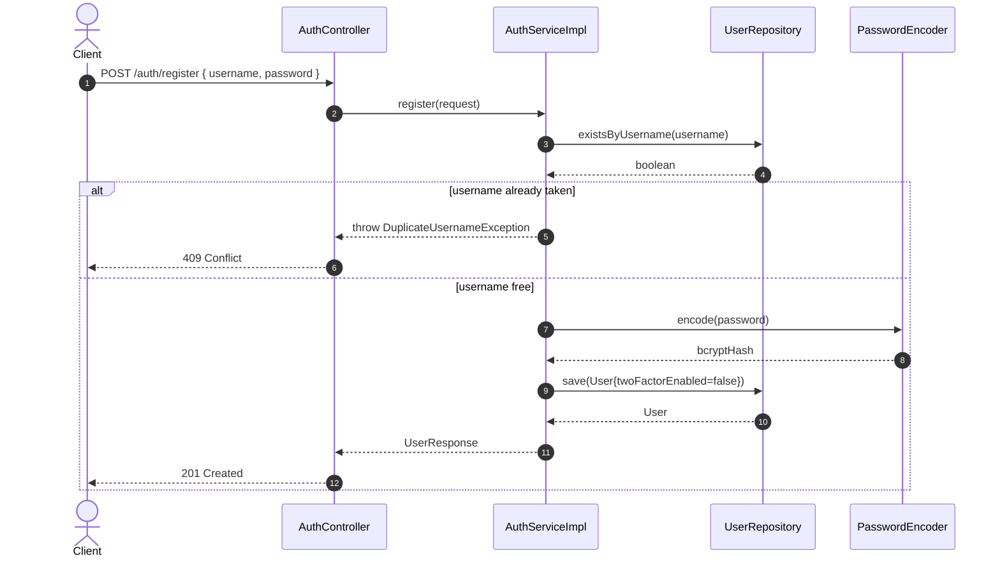
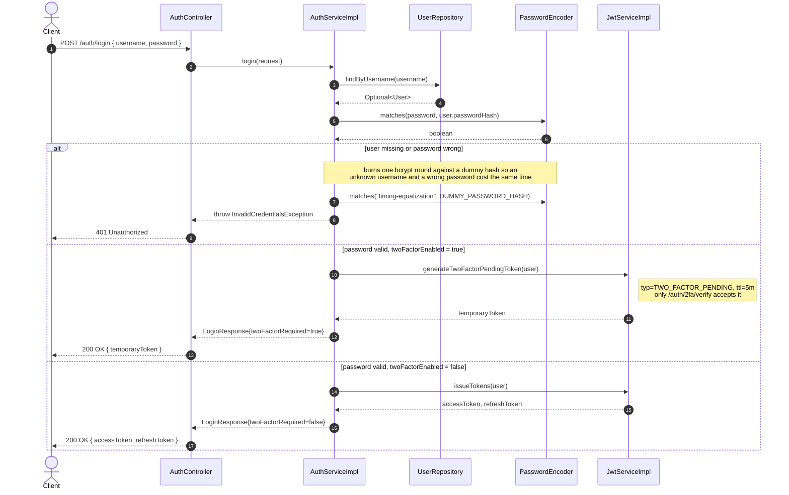
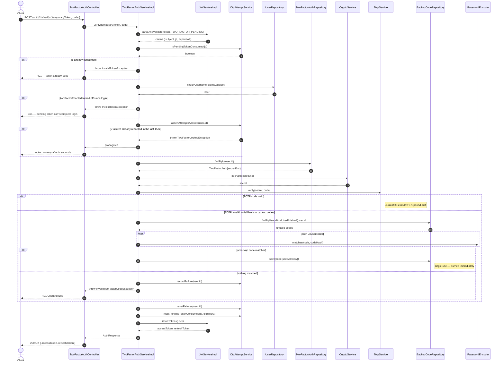
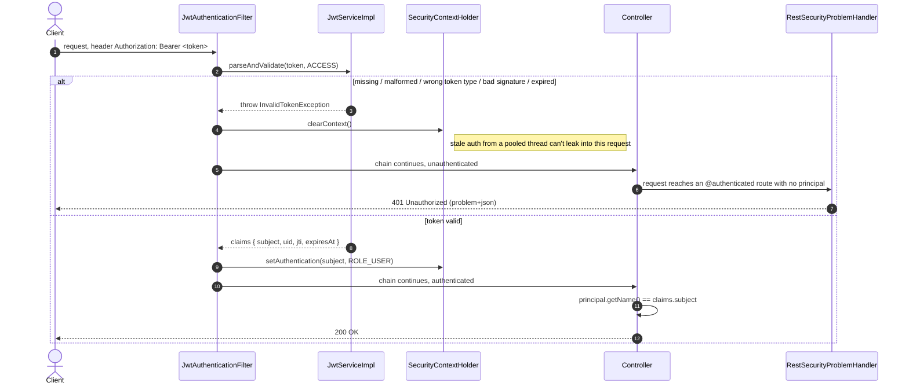
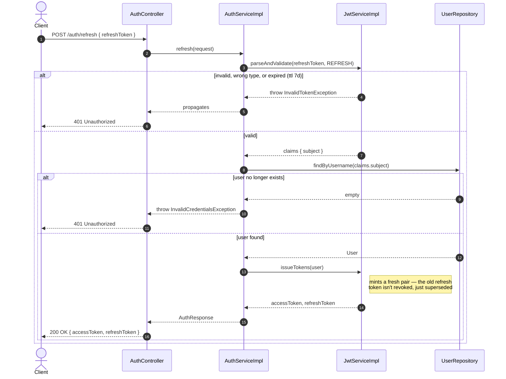
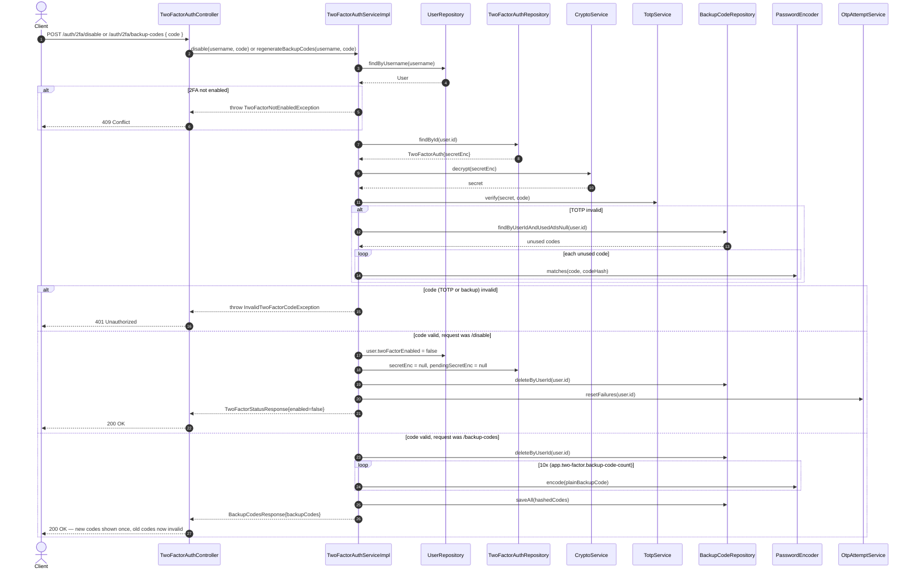

# Two-Factor Auth Flows

Sequence diagrams for every request/response path through the JWT + TOTP
two-factor authentication API, traced call-by-call from `controller` through
`service.impl` to `repository`. Generated from the current sources under
`src/main/java/com/example/spring_boot_project_api`.

**Key settings** (`application.properties`):

| Setting | Value |
|---|---|
| Access token TTL | 15m |
| Refresh token TTL | 7d |
| 2FA-pending token TTL | 5m |
| Lockout | 5 failures / 15m window → 15m lock |
| Backup codes | 10, single-use |
| Secret at rest | AES-256-GCM |

## Contents

1. [Register](#1-register)
2. [Login](#2-login)
3. [Verify 2FA code](#3-verify-2fa-code)
4. [Enable 2FA](#4-enable-2fa)
5. [Authenticated request](#5-authenticated-request)
6. [Refresh token](#6-refresh-token)
7. [Disable / regenerate 2FA](#7-disable--regenerate-2fa)

---

## 1. Register

`POST /auth/register` — creates an account with 2FA off by default. No tokens
are issued here; the client logs in separately afterward.



**Rules encoded above**

- The username-uniqueness check runs before any password hashing — a duplicate never touches `PasswordEncoder`.
- The plaintext password is never persisted; only the BCrypt hash reaches `UserRepository.save`.
- Every new row starts with `twoFactorEnabled=false`; 2FA is opt-in via a separate setup flow.

---

## 2. Login

`POST /auth/login` — password check only. The response shape depends on
whether the account has 2FA enabled: either full tokens, or a short-lived
token that grants nothing but the verify step.



**Rules encoded above**

- Unknown username and wrong password return the identical exception and cost the identical time, so timing can't be used to enumerate accounts.
- A 2FA-enabled account never gets a real access/refresh pair from `/login` — only a 5-minute pending token scoped to one endpoint.
- Accounts without 2FA skip the pending-token round trip entirely and walk out with full tokens on this one call.

---

## 3. Verify 2FA code

`POST /auth/2fa/verify` (public) — completes login for a 2FA account: trades
a pending token plus a 6-digit code (TOTP or backup code) for real tokens.



**Rules encoded above**

- `/auth/2fa/verify` is the one route in the whole API that accepts a `TWO_FACTOR_PENDING` token — every other endpoint rejects it (see [Authenticated request](#5-authenticated-request)).
- Each pending token completes login at most once: its `jti` is recorded as consumed the instant it succeeds.
- Failures are rate-limited per user — 5 in a rolling 15-minute window locks further attempts for 15 minutes.
- A TOTP mismatch isn't a hard fail: the same code is also checked against unused backup codes before the request is rejected.

---

## 4. Enable 2FA

`POST /auth/2fa/setup` → `POST /auth/2fa/enable` (authenticated) — two calls,
same session: stage a secret and get a QR code, then prove you can generate
a code from it before 2FA actually turns on.

```mermaid
sequenceDiagram
    autonumber
    actor C as Client
    participant TC as TwoFactorAuthController
    participant T2FA as TwoFactorAuthServiceImpl
    participant UR as UserRepository
    participant TAR as TwoFactorAuthRepository
    participant TOTP as TotpService
    participant CR as CryptoService
    participant BCR as BackupCodeRepository
    participant PE as PasswordEncoder

    note over C,TC: Step 1 — stage a secret (Authorization: Bearer access token)
    C->>TC: POST /auth/2fa/setup
    TC->>T2FA: setup(principal.username)
    T2FA->>UR: findByUsername(username)
    UR-->>T2FA: User
    alt 2FA already enabled
        T2FA-->>TC: throw TwoFactorAlreadyEnabledException
        TC-->>C: 409 Conflict
    end
    T2FA->>TOTP: generateSecret()
    TOTP-->>T2FA: secret
    T2FA->>CR: encrypt(secret)
    CR-->>T2FA: pendingSecretEnc
    T2FA->>TAR: save(TwoFactorAuth{pendingSecretEnc})
    note right of TAR: staged only — 2FA is still disabled
    T2FA->>TOTP: buildOtpauthUri(secret, username)
    TOTP-->>T2FA: otpauth://totp/...
    T2FA-->>TC: TwoFactorSetupResponse{secret, otpauthUri}
    TC-->>C: 200 OK — client renders it as a QR code

    note over C: user scans the QR in an authenticator app,<br/>then types back the 6-digit code it shows

    note over C,TC: Step 2 — confirm the code, enable 2FA
    C->>TC: POST /auth/2fa/enable { code }
    TC->>T2FA: enable(username, code)
    T2FA->>TAR: findById(user.id)
    TAR-->>T2FA: TwoFactorAuth{pendingSecretEnc}
    T2FA->>CR: decrypt(pendingSecretEnc)
    CR-->>T2FA: stagedSecret
    T2FA->>TOTP: verify(stagedSecret, code)
    alt code invalid
        T2FA-->>TC: throw InvalidTwoFactorCodeException
        TC-->>C: 401 — staged secret is kept, client may retry
    else code valid
        T2FA->>TAR: secretEnc = pendingSecretEnc; pendingSecretEnc = null
        T2FA->>UR: user.twoFactorEnabled = true
        T2FA->>BCR: deleteByUserId(user.id)
        loop 10x (app.two-factor.backup-code-count)
            T2FA->>PE: encode(plainBackupCode)
        end
        T2FA->>BCR: saveAll(hashedCodes)
        T2FA-->>TC: TwoFactorEnableResponse{backupCodes}
        TC-->>C: 200 OK — show the 10 codes once, never again
    end
```

**Rules encoded above**

- The secret is AES-256-GCM encrypted before it's ever written to `TwoFactorAuth.pendingSecretEnc` — nothing sensitive touches disk in the clear.
- 2FA only flips to `true` after the client echoes back a valid code — scanning the QR alone never enables it.
- A wrong confirmation code leaves the staged secret untouched, so the client can retry `/enable` without re-running `/setup`.
- Backup codes are generated and returned exactly once, at the moment 2FA turns on, and stored only as BCrypt hashes.

---

## 5. Authenticated request

`JwtAuthenticationFilter` — runs once per request, ahead of Spring
Security's own authentication filter, for anything not explicitly permitted
in `SecurityConfig`.



**Rules encoded above**

- Only `TokenType.ACCESS` passes here — a refresh token or a 2FA-pending token in the header is rejected exactly like a garbage string.
- `/auth/register`, `/auth/login`, `/auth/refresh`, and `/auth/2fa/verify` are the only POST routes that skip this check (permitted in `SecurityConfig`); everything else requires a valid access token.
- The filter is deliberately not a `@Component` — it's wired only into the security filter chain so it can't accidentally run twice and overwrite the authentication it just set.

---

## 6. Refresh token

`POST /auth/refresh` — trades a still-valid refresh token for a brand new
access/refresh pair, without re-checking the password.



**Rules encoded above**

- Only a `REFRESH`-typed token is accepted; an access token in this slot fails the same way an expired one would.
- There's no server-side denylist — refreshing doesn't revoke the token just used, so a leaked refresh token stays valid until its own 7-day expiry.
- If the user row was deleted after the token was issued, refresh fails closed with `InvalidCredentialsException` rather than trusting the token's claims alone.

---

## 7. Disable / regenerate 2FA

`POST /auth/2fa/disable` · `POST /auth/2fa/backup-codes` (authenticated) —
both endpoints share the same guard: a valid TOTP or backup code is required
before anything about the account's 2FA state changes.



**Rules encoded above**

- Neither endpoint trusts the session alone — both demand a fresh TOTP or backup code before touching account state.
- Disabling wipes `secretEnc`, `pendingSecretEnc`, and every backup code in one transaction; re-enabling later means starting [Enable 2FA](#4-enable-2fa) from zero.
- Regenerating backup codes invalidates every previously issued code, including ones that were never used.
